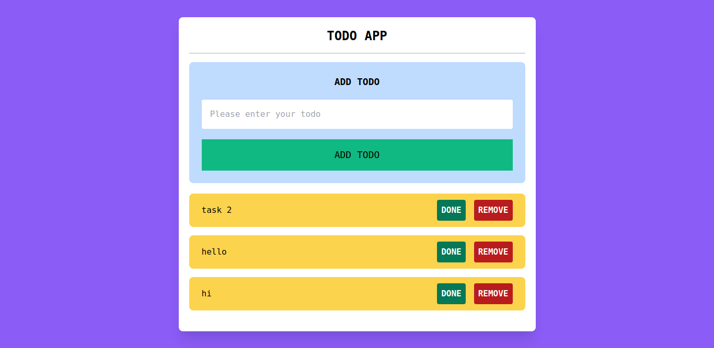

# go-todo
> Simple to do list API with Gin and Gorm (with Postgres) with Vue.js frontend




## Docker
Clone this repository and run:
```
docker-compose up
```

You can then hit the following endpoints:

| Method | Route      | Body                                         |
| ------ | ---------- | -------------------------------------------- |
| GET    | /tasks     |                                              |
| POST   | /tasks     | `{"title": "task title"}`                    |
| DELETE | /tasks/:id |                                              |
| PUT    | /tasks/:id | `{"title": "task title", "completed": true}` |
```
### Running locally
```
go run main.go
```

For state management Vuex has been used and for ajax request, Axios library has been used.

